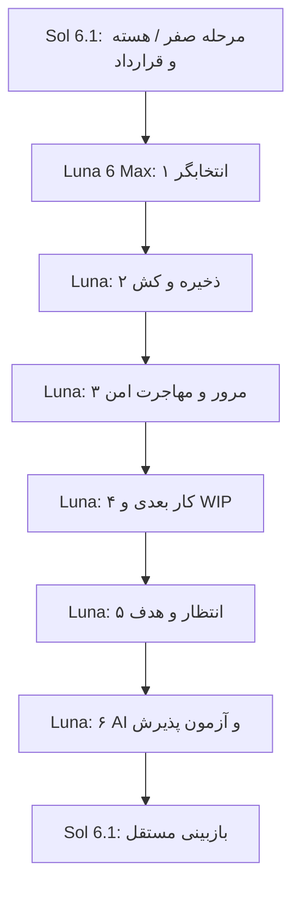

# قرارداد اجرای برنامه‌ریزی — مرحلهٔ صفر

مبنای این قرارداد main با commit `d3695a6` است. شاخهٔ کار: `codex/planning-phase-zero`. این سند برای ادامهٔ بسته‌های Luna نوشته شده؛ مشخصات قابلیت‌های بعدی به معنی پیاده‌شدن آن‌ها نیست.

## ۱. ثابت‌های محصول و طراحی

- هر تسک فقط یک زمان‌بندی عملیاتی؛ تب Plan باقی می‌ماند و همان داده را می‌خواند.
- رنگ، فونت، تم، ناوبری، چیدمان کلی و سبک کارت‌ها تغییر نکنند. اصلاح منطق و کنترل‌های ضروری با همان اجزای موجود انجام شود. مرحلهٔ صفر هیچ فایل CSS یا چیدمان را تغییر نمی‌دهد.
- Time block و Part of day/Time of day در محصول فعال نشوند. مدل قدیمی `deadline` هم به schedule v2 بازنگردد؛ قابلیت اختیاری `deadline_date` فقط برای مرحلهٔ آینده و طبق §۱۱ تأیید شده است و وارد `work_date/planning_*` یا بسته‌های اجرایی فعلی نمی‌شود. ساعت واقعی، یادآور، recurrence و مطالعه مستقل‌اند.
- ساختار frontend/، API ریشه، lockfile و Vercel حفظ شوند. هیچ force push یا merge خودکار به main انجام نشود.

## ۲. مدل عملیاتی و null

| حالت | ذخیرهٔ مرجع | معنا |
|---|---|---|
| none | work_date و planning_* برابر null | هیچ تعهد زمانی |
| day | work_date=`YYYY-MM-DD`؛ planning_* برابر null | روز بدون ساعت؛ تبدیل UTC ممنوع |
| datetime | work_date=ISO instant؛ schedule_timezone=IANA | ساعت صریح، حتی ۰۰:۰۰ و ۲۳:۵۹ |
| period | work_date=null؛ planning_horizon/start/end | دوره یا بازهٔ شامل دو سر؛ بدون ساعت ساختگی |

`schedule_v=2` مرجع این مدل است. فیلد absent در یک patch یعنی «تغییر نده»؛ null صریح در writer زمان یعنی «پاک کن». null برای work_date همراه period کامل یعنی جایگزینی با همان period، نه none. patch شامل work_date غیرخالی و planning_horizon غیرخالی ناسازگار است و رد می‌شود.

روز مشخص در هفته/ماه دیده شود و در هر نما یک بار حساب شود. ماه بدون روز وارد امروز نشود. بازهٔ دلخواه باید با هم‌پوشانی دیده شود و انتقال به بازهٔ بعد طول شامل دو سر را حفظ کند. بازه، تکرار روزانه نیست.

## ۳. توابع مشترک و writerها

- `readSchedule(task, settings?) -> TaskSchedule`: دادهٔ v2 فقط از مدل مرجع؛ legacy از adapter. datetime v2 هرگز با حدس نیمه‌شب به day تبدیل نشود.
- `scheduleFromDateValue(value, legacyAllDay=false) -> TaskSchedule`: برای نویسندهٔ جدید false؛ فقط reader legacy غیر exact می‌تواند true بدهد. در دادهٔ قدیمی exact، ساعت‌های مرزی واقعی حفظ شوند. حدس قدیمی مبهم باید در dry-run ثبت شود.
- `schedulePatch(schedule, settings?) -> Partial<Task>`: جایگزینی کامل، خنثی‌کردن تمام mirrorهای قدیمی، timezone روی datetime و null برای day/period/none.
- `workDatePatch(task, value)`: مسیر مشترک انتخاب روز/ساعت و AI؛ null یعنی none.
- `normalizeTaskWrite(row, settings?)`: patch ناقص work_date یا period را canonical کند؛ metadata-only را دست نزند؛ period ناقص و دو برنامهٔ هم‌زمان خطا هستند. فیلدهای حذف‌شدهٔ غیرnull را وارد مسیر فعال نکند؛ null مهاجرت محفوظ بماند. timezone/calendar معتبر موجود در row حفظ شوند.
- `persistTask(uid, task, options?) -> saved | queued | failed`: خطای اعتبارسنجی schedule => failed قبل از تغییر کش یا نوشتن؛ هیچ throw کنترل‌نشده برای ورودی ناسازگار. metadata روی legacy تعارض‌دار نباید یکی از برنامه‌ها را خودکار انتخاب کند؛ از patch محدود استفاده شود، نه بازنویسی کامل legacy.

مثال: period این هفته ← workDatePatch برای فردا ۱۵:۰۰ => planning_* null و work_date datetime. سپس normalizeTaskWrite({work_date:null}) => none؛ دادهٔ period قبلی برنگردد.

## ۴. منطقهٔ زمانی و API

زمان دقیق به عنوان instant حفظ می‌شود. رابط روی دستگاه، instant را به منطقهٔ زمانی فعلی نمایش می‌دهد؛ `schedule_timezone` زمینهٔ انتخاب اولیه برای استخراج روز در API است. عوض‌شدن منطقهٔ زمانی نمایش، instant را تغییر نمی‌دهد. اگر کاربر برای گزارش منطقهٔ متفاوتی می‌خواهد، زمینهٔ کاربر باید صریح باشد.

- frontend هنگام انتخاب datetime، IANA zone دستگاه را ثبت می‌کند؛ date-only هرگز UTC نمی‌شود.
- `scheduleWrite(value, timeZone?)` در API ساعت واقعی یا روز را به مدل مشترک تبدیل می‌کند. zone داده‌شده با Intl اعتبارسنجی می‌شود؛ zone نامعتبر/غایب => null، نه یک منطقهٔ زمانی ثابت.
- `taskDayOf(task, userTimeZone?) -> string | null`: date-only همان رشته؛ datetime بر اساس zone معتبر صریح کاربر، و در نبود آن zone ذخیره‌شدهٔ تسک. بدون zone معتبر => null. هیچ UTC slice یا حدس timezone میزبان برای روز کاربر انجام نشود.
- query تاریخ تقویمی از taskDayOf استفاده کند؛ unknown در فیلتر from/to تاریخ وارد نشود. query instant مستقل با timestamp انجام شود. caller با نیاز به تاریخ محلیِ دادهٔ قدیمی باید زمینهٔ معتبر کاربر بدهد؛ endpoint نباید ورودی timezone ناشناس را به هویت/مجوز بدل کند.
- مسیرهای create/patch تسک، assistant و calendar، schedule_timezone همراه ساعت واقعی را می‌پذیرند؛ schema/public docs در بستهٔ ۶ هماهنگ شوند. datetime قدیمی فاقد zone هنوز instant معتبر دارد، ولی روز محلی آن برای API بدون زمینه unknown است؛ این محدودیت را پنهان نکن.

## ۵. ذخیره، آفلاین و هم‌زمانی — قرارداد بستهٔ ۲

callback تغییر تسک باید Promise وضعیت دقیق بدهد. undefined/void/boolean جای وضعیت نگیرد. شکست قطعی: draft محفوظ، پیام موفقیت ممنوع؛ queued: ذخیرهٔ محلی، نه ذخیرهٔ ابری. thrown: failed با آزادشدن busy در finally. rollback فقط نسخهٔ خوش‌بینانهٔ همان عملیات را برگرداند و ویرایش جدیدتر را پاک نکند. عملیات گروهی شمارش موفق/queued/failed واقعی بدهد. دوبارکلیک و retry از شناسهٔ پایدار همان intent استفاده کنند.

empty موفق سرور با loading/error فرق دارد. کش‌ها و subscriptionها وابسته به uid و پاسخ قدیمی پس از تعویض uid غیرقابل اعمال باشند.

## ۶. مهاجرت امن — پیاده‌سازی در بستهٔ ۳

**اجرای خودکار مهاجرت از subscribeToTasks در مرحلهٔ صفر متوقف شده است.** reader سازگار باقی است؛ دادهٔ حساب واقعی مهاجرت انبوه نمی‌شود. helper قدیمی migrateTaskSchedules ابزار نهایی امن محسوب نمی‌شود و تا اجرای این قرارداد به login متصل نشود.

۱. dry-run بدون write: uid، taskId، نسخه، fingerprint فیلدهای برنامه و updated_at، پیشنهاد تبدیلی، backup مورد نیاز، conflict و timezone ناشناخته. شمارش رکوردهای آماده/تعارض/نامعتبر.

۲. کلید عملیات uid+taskId+fingerprint؛ تلاش‌های حساب‌ها مستقل. پشتیبان فیلدهای اصلی، از جمله timezone/calendar، و تصمیم انتخابی در envelope نسخه‌دار حفظ شود. backup قبلی overwrite نشود.

۳. تعارض: روز/ساعت بیرون دوره، دو مقدار دقیق متفاوت یا نشان legacy مبهم => تصمیم خودکار ممنوع. مقادیر اصلی و توضیح در دیالوگ موجود؛ کاربر یکی را انتخاب یا فعلاً تعویق دهد. تا تصمیم، فقط خواندن سازگار قبلی؛ دادهٔ عملیاتی دوم جدید ساخته نشود.

۴. تبدیل تأییدشده فقط online و در transaction با بازخوانی و مقایسهٔ fingerprint. اگر رکورد تغییر کرده، دوباره dry-run؛ patch قدیمی apply نشود. تبدیل offline را به صف blind upsert نفرست. شکست قابل retry؛ تسک‌های تازهٔ حین job در اجرای بعد پوشش یابند.

۵. migrated v2 دست‌نخورده؛ اجرای دوباره idempotent. rollback نیز تنها با compare-and-set نسبت به خروجی مهاجرت و با حفظ ویرایش جدید مجاز است. یادآور، تکرار، مطالعه، مالکیت، شناسه و روابط تغییر نکنند.

## ۷. تاریخچهٔ مرور — قرارداد بستهٔ ۳

کلید دوره از horizon/start/end/calendar تشکیل شود؛ uid مالک است. نسخه‌های پایان مرور append-only در حساب ذخیره شوند؛ latest اشاره‌گر است، نه تنها تاریخچه. هر نسخه شامل note، snapshot عنوان/شناسه/وضعیت کارها، زمان ثبت و نسخهٔ مبناست. تمام فهرست‌ها و progress گزارش پایان‌یافته از همان snapshot؛ انتقال بعدی تسک آن را تغییر ندهد.

اصلاح گزارش، نسخهٔ جدید با reference نسخهٔ قبلی؛ رقابت روی latest از طریق transaction و base revision تشخیص داده شود. آفلاین یک draft/outbox وابسته به uid و شناسهٔ intent بسازد؛ تا commit قطعی وضعیت pending داشته باشد. شکست permission به reviewed موفق محلی تبدیل نشود. متن dirty با ورودی ابری overwrite نشود؛ دو متن متفاوت نیاز به حل تعارض دارند. legacy note حفظ و مهاجرت شود؛ snapshot تاریخیِ ناموجود جعل نشود.

## ۸. روابط و وضعیت‌ها — قرارداد بستهٔ ۵

- parent_id فقط زیرتسک؛ plan_parent_id ارتباط اقدام با هدف/پروژه. clear schedule هیچ رابطه‌ای را پاک نکند. حذف واقعیِ زیرتسک از قرارداد cascade استفاده کند؛ هدفِ مرتبط به‌خاطر حذف اقدام پاک نشود. چرخه و ارجاع به خود در هر رابطه ممنوع؛ والد غایب نمایش امن داشته باشد.
- status: todo/in_progress/waiting/done/wont_do. waiting مستقل از تاریخ؛ waiting_reason اختیاری و prerequisite references مستقل از parentها. completed فقط با done سازگار؛ wont_do انجام‌شده نیست.
- تمام پیش‌نیازها باید برقرار باشند تا اقدام آماده شود؛ پیش‌نیاز حذف‌شده/کنارگذاشته‌شده «موفق» نیست، نیاز به تصمیم کاربر دارد. پایان پیش‌نیاز فقط readiness را به‌روز کند، نه ساعت/شروع خودکار. برگشت پیش‌نیاز به ناتمام readiness را دوباره مسدود کند.
- برای پیش‌نیاز تکراری، یک وقوع مشخص با شناسه/کلید occurrence ثبت شود؛ completion آن وقوع از activity/ثبت تکمیل خوانده شود، نه completed فعلی تسک که هنگام advance دوباره false است. اگر سرویس هنوز شناسهٔ وقوع ندارد، لینک خودکار تکراری را فعال نکن؛ انتظار دستی با توضیح ممکن بماند و این محدودیت گزارش شود. occurrence identity را بر اساس عنوان نساز.
- پیشرفت زیرتسک بر اساس leafهای یکتا؛ parent و descendant با هم دوباره‌شماری نشوند. درصد اجرای اقدام با نتیجهٔ هدف یکسان نیست؛ goal finish criterion اختیاری، مستقل از محاسبهٔ درصد.

## ۹. افزودن‌ها — قرارداد بستهٔ ۴ و ۶

کار بعدی: انتخاب دستی uid-scoped، اولیه null، done/wont_do/waiting نامعتبر؛ کار آینده تنها پس از تصمیم صریح زمان. تکمیل یا حذف، انتخاب را پاک کند؛ reopening خودکار آن را بازنگرداند. چند کار مهم روز یک انتخاب اختیاری با کلید روز تقویمی و uid باشد، نه تغییر معنای pinned یا شرط ایجاد کار.

WIP: اولیه off، حد پیشنهادی ۳، هشدار نرم؛ فقط in_progress بازِ همان uid در کل تسک‌های فعال شمارش شود، شامل کار خارج از امروز؛ parent غیر اجرایی دوباره‌شماری نشود. نگهداری انتخاب روی دستگاه و sync مطابق قرارداد ذخیره؛ دادهٔ حساب قبلی نمایش داده نشود.

AI از TaskAIPanel و writer مشترک؛ پیشنهاد قبل از پذیرش هیچ write نکند، دلیل/اثر روشن، بدون تاریخ یا ساعت ساختگی. جملهٔ اگر/آنگاه و معیار پایان اختیاری. هیچ موتور، صفحه یا طراحی جدیدی ساخته نشود.

## ۱۰. معیار عبور و ادامه

مرحلهٔ صفر فقط قرارداد و اصلاح هسته است. بستهٔ ۱ هنوز timer و ساعت ۹ خودکار را اصلاح می‌کند؛ بسته‌های ۲ تا ۶ طبق سند تقسیم کار ادامه می‌یابند. تست‌های ساعت مرزی، direct writer/clear، exact legacy و zoneهای مثبت/منفی لازم‌اند. typecheck و build باید موفق باشند. وابستگی نصب‌شده و محدودیت تست صادقانه گزارش شود. دادهٔ واقعی و ظاهر در این مرحله دست‌نخورده‌اند.

## ۱۱. قابلیت آیندهٔ مصوب — Deadline اختیاری و کم‌مزاحمت

این بند محدودهٔ محصول را برای مرحلهٔ آینده ثبت می‌کند؛ هیچ بستهٔ اجرایی فعلی را شروع یا بازنویسی نمی‌کند. پیاده‌سازی فقط با درخواست اجرایی جداگانه و پس از قبولی E2E هستهٔ زمان‌بندی آغاز می‌شود.

- هر تسک همچنان حداکثر یک زمان‌بندی عملیاتی در `work_date` یا `planning_*` دارد؛ در کنار آن می‌تواند Deadline مستقل و اختیاری داشته باشد. فیلد مرجع جدید `deadline_date` و مقدار آن تاریخ محلی `YYYY-MM-DD` است؛ date-only از جابه‌جایی UTC محافظت می‌کند. نسخهٔ اول برای تسک‌های یک‌باره است و ساعت یا قاعدهٔ Deadline تکرارشونده ندارد.
- مقدار خالی یعنی Deadline تنظیم نشده. این فیلد اجباری یا حدس‌زدنی نیست. اعلان خودکار ندارد؛ `reminder_at/reminder_plan` مستقل باقی می‌مانند.
- ظاهر: فقط یک کنترل کوچک در جزئیات تسک؛ بدون صفحه، تب، مسیر ناوبری، کارت داشبورد یا فهرست تازه. در تقویم موجود یک نشان کوچک روی روز Deadline؛ در ردیف تسک، نشان «مهلت نزدیک» فقط تا ۷ روز مانده و «مهلت گذشته» برای تسک باز. همان تسک یک بار شمارش شود؛ اگر زمان‌بندی و Deadline یک روز دارند، نشان‌ها در همان ردیف ترکیب شوند.
- «مهلت گذشته» تابع Deadline باشد و از دیرکرد `work_date`/planning مستقل محاسبه شود. تغییر schedule مقدار Deadline را عوض نکند؛ تغییر Deadline schedule را عوض نکند؛ دیرکرد باعث جابه‌جایی یا تکمیل خودکار نشود.
- فیلد قدیمی `deadline` در `REMOVED_FEATURE_FIELDS` retired است؛ آن را فعال یا به‌عنوان نام مرجع استفاده نکن. مقدار قدیمیِ موجود در backup `schedule_legacy` بدون تأیید/مهاجرت صریح به فیلد جدید برنگردد. writerهای frontend و Firebase، readers، Task type، API create/patch، Agent API schema/write paths، جزئیات تسک، نماهای لیست و تقویم، exportهای متاثر و AI باید جداگانه بررسی و هماهنگ شوند. AI فقط تاریخ قطعی‌ای را پیشنهاد/ذخیره کند که کاربر صریحاً به‌عنوان مهلت گفته و تأیید کرده باشد.
- آزمون‌های پذیرش: schedule دوشنبه + Deadline جمعه؛ تغییر هریک بدون تغییر دیگری؛ عبور از Deadline بدون auto-reschedule؛ complete removes overdue marker; no deadline leaves UI unchanged; same-day item counted once; no notification without an explicit reminder; date-only survives timezone and Jalali/Gregorian display; Persian/English and light/dark UI remain compact.

## ۱۲. نقشهٔ راه قابلیت‌های پژوهش‌شده — مرز اجرا

جزئیات تطبیق کد و موج‌های پیشنهادی در plan/plan.md، بخش «نقشهٔ راه پژوهش‌شده» ثبت شده است. این فهرست برنامهٔ آینده است؛ فازهای فعال زمان‌بندی ۱ تا ۳ را تغییر نمی‌دهد و مجوز تغییر source code ایجاد نمی‌کند. Deadline اختیاری فقط طبق §۱۱ برای آینده تأیید شده است.

- مبنای بازبینی کد، main در تاریخ ۲۰۲۶-۱۰-۰۷ است: تقویم ماه/هفته/روز/فهرست، جزئیات غنی تسک، نوت مستقل و نوت تسک، AI پنل تسک، قالب تک‌تسک، قالب‌های آموزشی، HTML امن Knowledge، و Focus متصل به تسک از قبل وجود دارند. قبل از افزودن هرکدام، از فایل‌های واقعی کد و writer/reader مشترک بازبینی شود تا قابلیت تکراری نسازیم.
- تقویم Agent در نسخهٔ فعلی رویداد را از تسک زمان‌دار می‌خواند/می‌سازد؛ افزودن اتصال تقویم خارجی باید هویت منبع، حذف/ویرایش و جلوگیری از دادهٔ تکراری را طراحی کند. رویداد بیرونی نباید دومین schedule یک تسک شود.
- قالب پروژه، قالب نوت و استخراج Action Item قابلیت تازه‌اند. ساخت قالب از HTML آزاد ممنوع؛ از مدل تسک و RichEditor/Markdown فعلی و HTML پاک‌سازی‌شدهٔ Knowledge فقط در محدودهٔ خودش استفاده شود.
- AI جدید فقط در پنل‌ها و مسیرهای فعلی بررسی شود: زمینهٔ انتخابی، بدون Diary یا محتوای سلامت/ذهنی به‌طور پیش‌فرض، پیش‌نمایش واضح، تأیید کاربر قبل از write، writer مشترک و بررسی موفقیت واقعی.
- Focus دارای زمان‌سنج task-aware، ثبت جلسه، نمای امروز/هفت روز و history است. تخمین جلسه یا گزارش جدید فقط بعد از بررسی مدل و حفظ جدایی از time block و estimated_minutes قدیمی.
- هر موج آینده باید با درخواست اجرایی مجزا، آزمون‌های مرتبط، بررسی RTL/انگلیسی، موبایل/دسکتاپ و بدون تغییر Firebase/Vercel config آغاز شود. موردی که فقط «پیشنهاد» یا «مرحلهٔ دیرتر» دارد وارد پیاده‌سازی فعال نشود.
